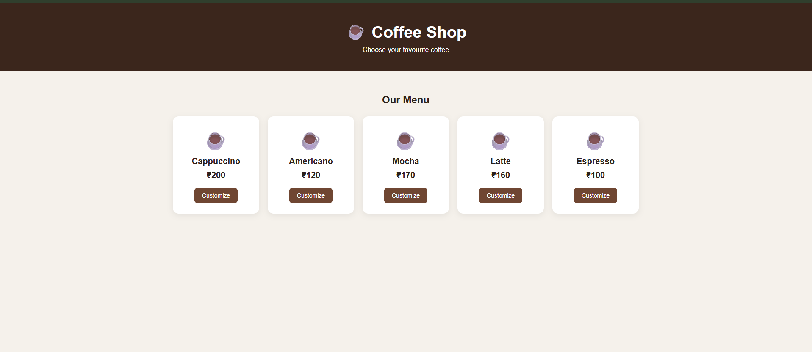
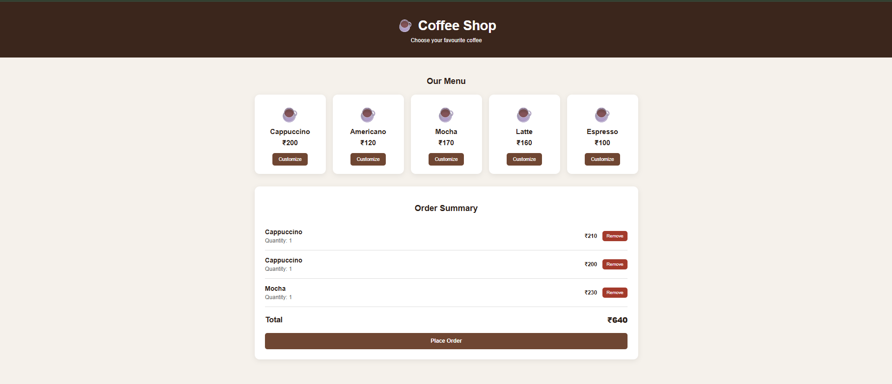
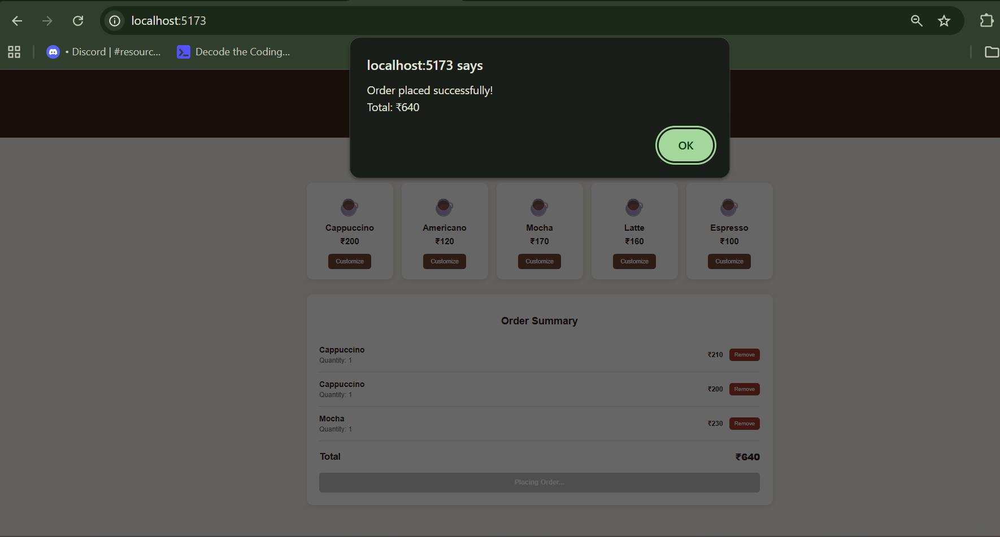

# Coffee Shop Ordering System

This is a full-stack Coffee Shop Ordering System built using React, Node.js, Express and MongoDB.

The application allows customers to select drinks, customize them, choose quantity, review their order and place the order.

The main focus of the project is to keep the pricing logic in the backend and make the system easy to extend with new drinks and customizations.

---

## Tech Stack

### Frontend

- React.js
- Vite
- JavaScript
- CSS

### Backend

- Node.js
- Express.js

### Database

- MongoDB
- Mongoose

### Testing

- Postman

---

## Features

- View available drinks
- Select a drink
- Add customizations
- Select quantity
- Add multiple drinks to an order
- Add the same drink with different customizations
- Remove items from the order
- Calculate order total
- Place an order
- Validate drinks and customizations
- Store order-time prices

---

## Screenshots

### Menu



### Order Summary



### Order Confirmation



---

## Backend Structure

I used a simple layered structure:

```text
Routes
   ↓
Controllers
   ↓
Services
   ↓
Repositories
   ↓
Models
   ↓
MongoDB
```

I used this structure to keep different responsibilities separate.

### Routes

Routes define the API endpoints and connect them with the controllers.

### Controllers

Controllers handle HTTP requests and responses.

There are separate controllers for drinks, customizations and orders.

### Services

The service layer contains the main business logic.

`OrderService` is responsible for validating the order, checking availability, getting customizations and creating the final order.

### Repositories

Repositories handle database operations.

I created separate repositories for:

- Drinks
- Customizations
- Orders

This keeps database-related code separate from the business logic.

### Price Calculator

The price calculation is kept separately in `PriceCalculator`.

This keeps pricing logic independent from the controllers and database code.

---

## Database Models

### Drink

A drink contains:

```text
name
basePrice
isAvailable
```

### Customization

A customization contains:

```text
name
priceAdjustment
isAvailable
```

### Order

An order contains multiple order items.

Each order item stores:

```text
drinkId
drinkName
quantity
basePrice
customizations
unitPrice
totalPrice
```

The order also stores the final `totalPrice`.

---

## Handling Different Customizations

The same drink can be added with different customization configurations.

For example:

```text
Cappuccino × 1
No customization

Cappuccino × 1
Extra Sugar + Additional Shot

Latte × 1
Extra Chocolate
```

These are stored as separate order items because their configurations are different.

If the same drink has the same customization configuration, its quantity can be increased.

For example:

```text
Cappuccino × 3
Extra Sugar
```

can be stored as one order item with quantity 3.

---

## Price Calculation

The price calculation is handled in the backend using the separate `PriceCalculator` class.

For one drink:

```text
Unit Price = Base Price + Customization Prices

Item Total = Unit Price × Quantity
```

The final order total is the sum of all item totals.

For example:

```text
Cappuccino = ₹200
Extra Sugar = ₹10
Additional Shot = ₹40

Unit Price = ₹200 + ₹10 + ₹40
           = ₹250
```

If the quantity is 2:

```text
Item Total = ₹250 × 2
           = ₹500
```

The frontend only sends the drink ID, customization IDs and quantity.

The frontend does not send the final price.

The backend gets the actual prices from the database and calculates the final amount.

This keeps the backend as the source of truth for pricing.

---

## Price Snapshot

When an order is created, the drink and customization prices are stored inside the order.

For example, if a drink costs ₹150 when an order is placed and the menu price is later changed to ₹200, the old order will still contain the original price.

This prevents changes in the current menu price from changing the price of old orders.

It also keeps the order history accurate.

---

## API Endpoints

### Drinks

```text
GET  /api/drinks
POST /api/drinks
PUT  /api/drinks/:id
```

### Customizations

```text
GET  /api/customizations
POST /api/customizations
PUT  /api/customizations/:id
```

### Orders

```text
POST /api/orders
GET  /api/orders/:id
```

---

## Order Creation

For creating an order, the frontend sends:

```text
drinkId
quantity
customizationIds
```

The backend then:

1. Checks that the order contains at least one item.
2. Checks that the quantity is valid.
3. Checks that the drink exists.
4. Checks that the drink is available.
5. Checks that each customization exists.
6. Checks that each customization is available.
7. Calculates the item price.
8. Calculates the final order total.
9. Stores the order with the calculated prices.

---

## Validation

The backend validates the following cases:

- Order must contain at least one item.
- Quantity must be a positive integer.
- Drink must exist.
- Drink must be available.
- Customization must exist.
- Customization must be available.

I tested the main validation cases using Postman.

---

## Scalability and Maintainability

The application uses a layered structure where routes, controllers, services, repositories and models have separate responsibilities.

The API does not keep orders in application memory. Orders are stored in MongoDB, so multiple customers can place orders without depending on shared in-memory application state.

The current structure also makes it easier to maintain and extend individual parts of the application.

For example, pricing logic can be changed in `PriceCalculator` without putting pricing code inside the controllers.

If the application grows in the future, additional improvements such as database indexing, caching or other performance optimizations can be added when required.

---

## Future Changes

### Adding New Drinks

A new drink can be added through the drink API with its name and base price.

The existing order calculation logic does not need to be changed.

### Adding New Customizations

A new customization can be added through the customization API with its name and price adjustment.

The existing pricing logic automatically includes the customization price.

### Changing Prices

Drink and customization prices can be updated through their APIs.

New orders will use the latest prices, while existing orders keep their stored price snapshots.

### More Complex Pricing

If more complex pricing rules are required in the future, the pricing logic can be extended separately in `PriceCalculator`.

This avoids putting pricing rules directly inside controllers or database models.

---

## Assumptions

1. Customer login is not required for this assignment.
2. Payment processing is outside the scope of the assignment.
3. A customization has a fixed price adjustment.
4. A drink can have multiple customizations.
5. Only available drinks and customizations can be ordered.
6. The backend is responsible for calculating the final price.
7. Old orders keep their original prices.
8. Order cancellation after an order has been placed is outside the current scope.

---

## How to Run

### Backend

Open a terminal and run:

```bash
cd backend
npm install
npm run dev
```

Backend runs on:

```text
http://localhost:5000
```

### Frontend

Open another terminal and run:

```bash
cd frontend
npm install
npm run dev
```

Frontend runs on:

```text
http://localhost:5173
```

---

## Environment Variables

Create a `.env` file inside the `backend` folder:

```env
PORT=5000
MONGODB_URI=your_mongodb_connection_string
```

The `.env` file should not be pushed to GitHub.

---

## Project Structure

```text
Coffee-Shop/
│
├── backend/
│   ├── src/
│   │   ├── config/
│   │   │   └── db.js
│   │   │
│   │   ├── controllers/
│   │   │   ├── CustomizationController.js
│   │   │   ├── DrinkController.js
│   │   │   └── OrderController.js
│   │   │
│   │   ├── models/
│   │   │   ├── Customization.js
│   │   │   ├── Drink.js
│   │   │   └── Order.js
│   │   │
│   │   ├── repositories/
│   │   │   ├── CustomizationRepository.js
│   │   │   ├── DrinkRepository.js
│   │   │   └── OrderRepository.js
│   │   │
│   │   ├── routes/
│   │   │   ├── CustomizationRoutes.js
│   │   │   ├── DrinkRoutes.js
│   │   │   └── OrderRoutes.js
│   │   │
│   │   └── services/
│   │       ├── OrderService.js
│   │       └── PriceCalculator.js
│   │
│   ├── app.js
│   ├── server.js
│   └── package.json
│
├── frontend/
│   ├── src/
│   │   ├── App.jsx
│   │   ├── App.css
│   │   ├── index.css
│   │   └── main.jsx
│   └── package.json
│
├── screenshots/
│   ├── menu.png
│   ├── order-summary.png
│   └── order-confirmation.png
│
├── .gitignore
└── README.md
```

---

## Future Improvements

Some features that can be added later:

- Customer authentication
- Order history
- Order status
- Admin panel
- Payment integration
- Inventory management
- Automated tests
- Better error handling and validation
- Database indexing for larger datasets